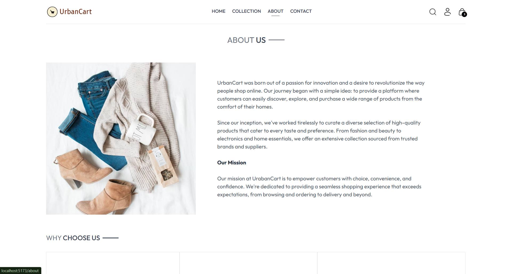
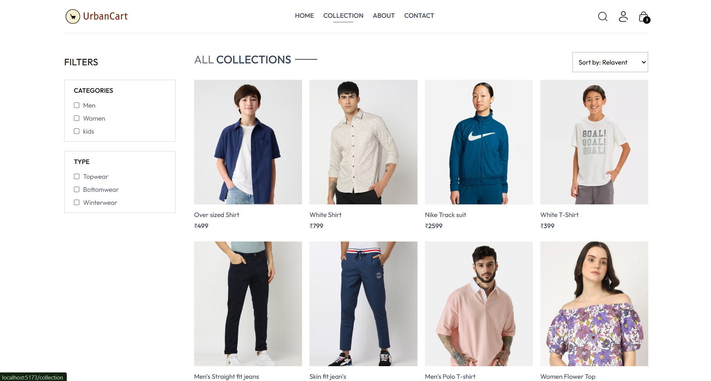
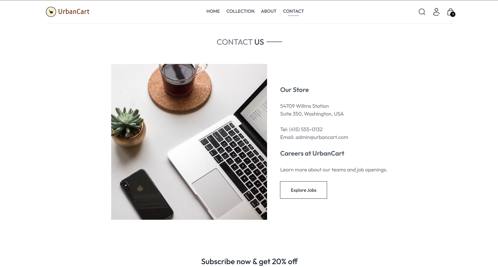
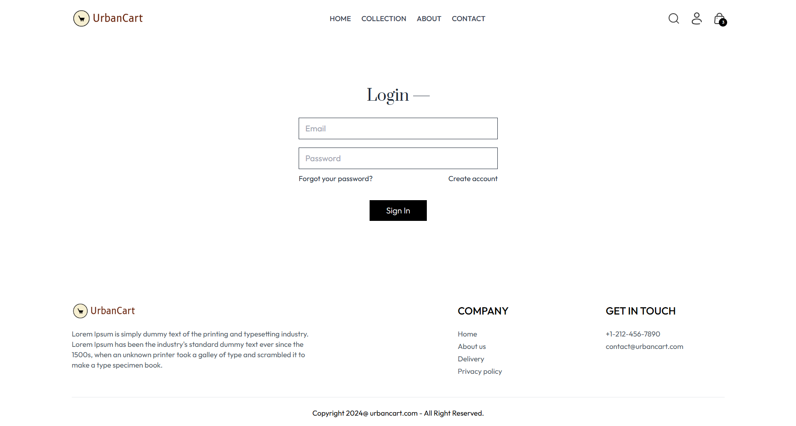
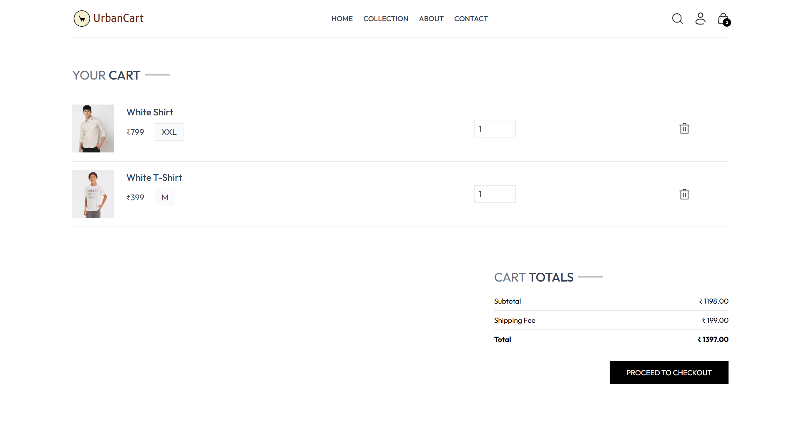
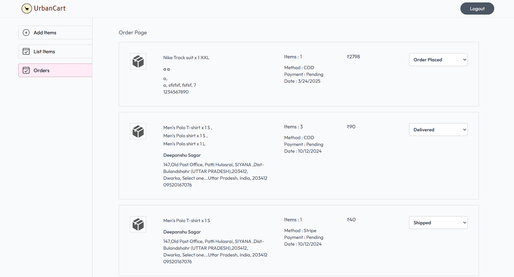
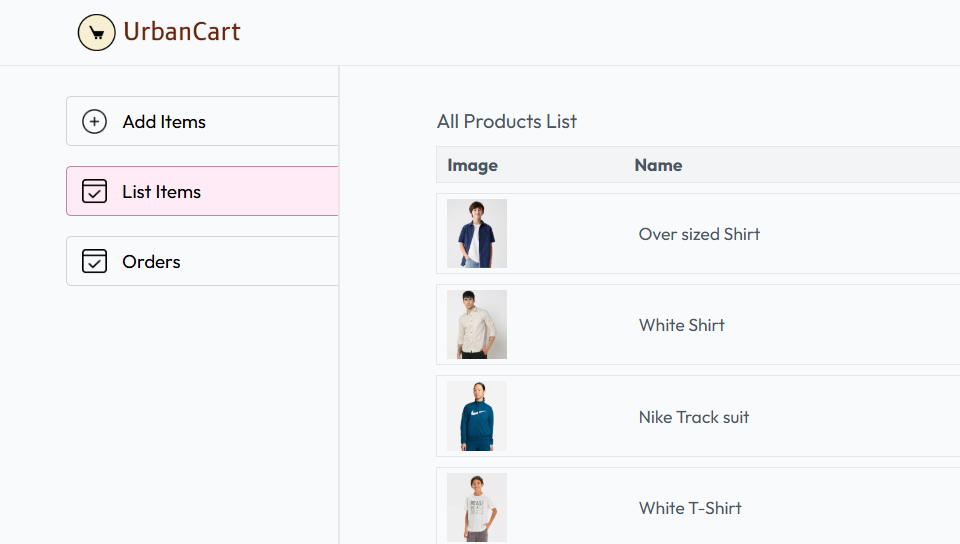
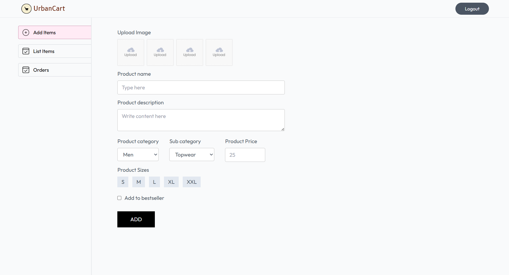

Urban Cart 🛒

Urban Cart is a full-stack e-commerce web application built using modern web technologies. The project is structured into three main modules — Frontend, Backend, and Admin Panel — each running independently to maintain modularity and scalability.

🛠 Tech Stack
- Frontend: React.js, Tailwind CSS
- Backend: Node.js, Express.js
- Admin Panel: React.js, Tailwind CSS
- Database:(Add MongoDB, MySQL, or your database name here)
- Deployment: (Optional — if deployed)

📚 Project Structure
- `/frontend` → User-facing e-commerce website
- `/backend` → Server-side APIs and database handling
- `/admin` → Admin dashboard for product and order management

Each module needs to be run separately for local development.

🚀 How to Run Locally

1. Clone the repository
2. install dependencies
3. run each module separately 
4. enjoy 

📸 Screenshots

# About Page

### Collection Page

### Contact Page

### Login Page

### Cart Page

### Orders Page

### Product List (Admin)

### Add Product (Admin)

✨ Features
1. User authentication and registration

2. Dynamic product browsing

3. Add to cart and checkout

4. Order management system

5. Admin dashboard for managing products, orders, and users

6. Responsive design compatible with mobile and desktop devices

